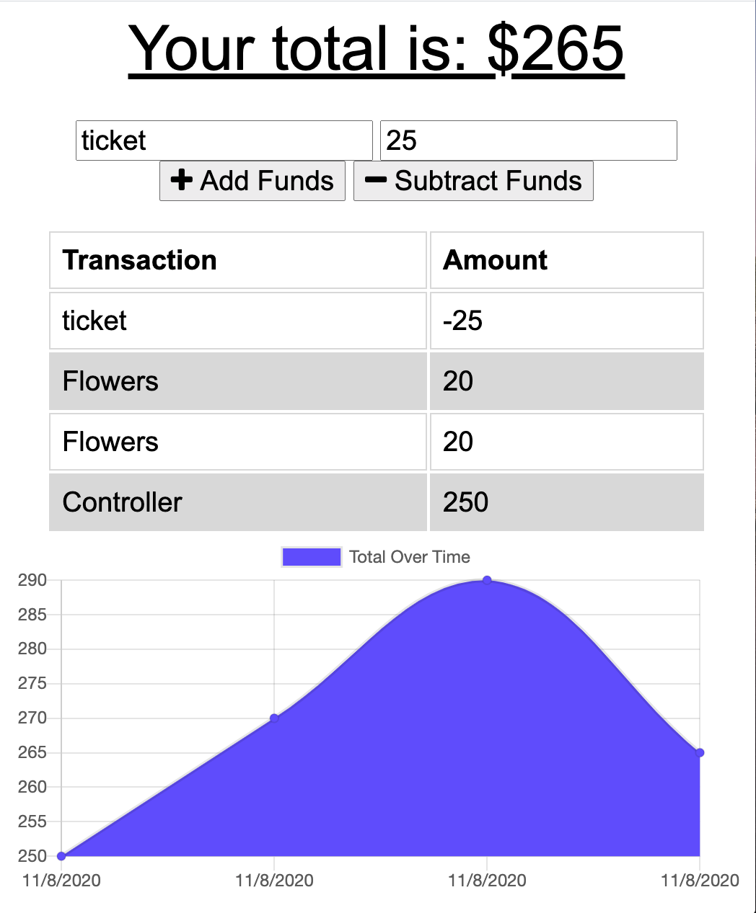

# Budget Tracker

## license


## Description

This application allows users to keep track of how much money they are wasting. And how much they have comming in, giving you a total result of you'r current budget

## Main Window

  


## Table of contents

- [Description](#Description)
- [Installation](#Installation)
- [Usage](#Usage)
- [Licence](#License)
- [Contributors](#Contributors)
- [Repository Link](#Repository)
- [GitHub Info](#GitHub)

  ## Installation

  - Clone the reposatory into a local file in you're computer.
  - Run "npm i" inside of the terminal.
  - Create a mongodb database named "budget"
  - Run "node server" for the application to start.

  ## Usage

- This application uses a sevice worker file that keeps track of all of the files that need to be downloaded into our application for this one to work like a native application.
- Using Robo 3T for our database.
- We can add new transactions and these will be saved even when offline.
 ## Directory 

 ```
├── models
│   └── transaction.js
│ 
│ 
├── node_modules 
│ 
│── public
│   ├── icons
│   ├── images
│   ├── db.js
│   ├── index.html
│   ├── index.js
│   ├── manifes.webmanifest
│   ├── service-worker.js
│   └── style.css
│
│
├── routes
│   └── api.js
│
│
├── .gitignore
│
├── package-lock.json
│
├── package.json   
│
├── README.md
│
└── server.js

```

  ## Constributors

  Miguelangel Weill

  ## Git hub user name

  miguelangelWeill

  ## Repository


[Git hub profile](https://api.github.com/users/Miguelangelweill)

[This is my Git Hub repository](https://github.com/Miguelangelweill)
